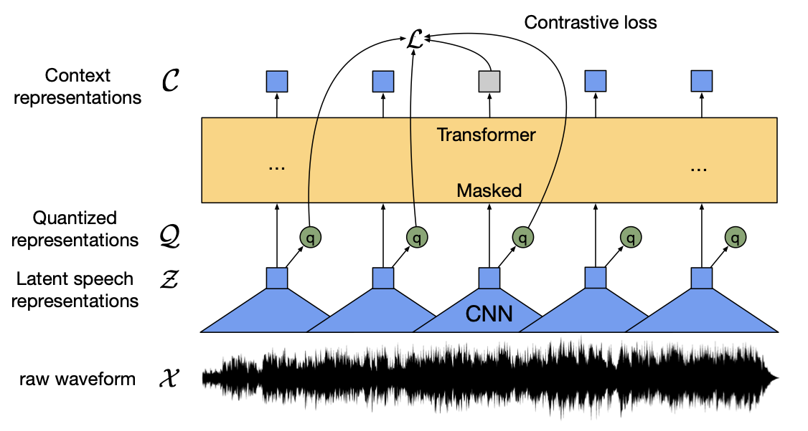

# Wav2Vec2

- [ ] older ways to do speech - text
- [ ] wav2vec2 - BERT of speech
- [ ] Major issue in speech
- [ ] gentle intro to transformers
- [ ] wav2vec2 architecture
- [ ] layer by layer explaination (feature extractor, transformers)
- [ ] why need of feature extractor
- [ ] why can't have transformers directly (instead of feature extractor)
- [ ] CTC a gentle intuition & guide
- [ ] reference to other posts
- [ ] other large dataset training details
- [ ] evaluation speech models

## Introduction

Speech recognition task aims at recognizing speech and converting it into text.

Transformers based models has shown promising results in many NLP tasks such as question-answering, summarization, translation. Wav2Vec2 was the first attempt to take transformers-like models to Speech Recognition task. Wav2Vec2 is sometimes called as BERT of speech and several recent papers in speech related tasks are citing Wav2Vec2 model.

In this blog post, you will be reading about Wav2Vec2 architecture and how to train TensorFlow Wav2Vec2 on very large datasets (> 100 GBs) using Cloud's TPUs.

## Self-supervised Learning and Pre-trained models

It's often crucial to train models on very large datasets to be able to achieve good results. But collecting labelled data can be very expensive. Self-supervised learning can help us to reduce the need of expensive labelled dataset. In self-supervised learning, labels are built from inputs and model is trained using those inputs, labels pairs. These labels can be built by removing some part of inputs or by introducing some noise in inputs; and model is often trained to clean up & produce correct samples. This way we train the model on general tasks and not on our very specific task. This way, model can actually understand the language structure (if it's text or speech dataset), visual structues (if it's image based dataset).

Now, those pre-trained weights are saved and model is trained on downstream tasks after initializing it from saved pre-trained weights. This often reduces the need of large data for downstream task, as model already possess understanding of general language and need not learn that during fine-tuning.

Wav2Vec2 is trained by masking latent space of speech representations and model training objective is to fill-up those masks.

## Architecture details

Wav2Vec2 is the BERT-like transformer encoder on the top of simple convolutional layers which act as feature extractor layers.

A very simple question one can ask is why do we need convolutional layers in the first place? 
Some of the possible reasons are that: In NLP, we have descrete words and each token can be simply represented with the embedding vectors. But in speech, everything is continuous and it's not easy to map what part of speech is repsented by how many numbers. So, there is a need to extract features from the raw speech and further put it into Transformer model which can learn context for the extracted features.

```python
# put some speech sample
```



### Transformers

Transformers are introduced in paper- [`Attention Is All You Need`](https://arxiv.org/abs/1706.03762). After this paper, several recent SOTA models are built on the top of transformers and has shown promising results in many NLP, speech & vision tasks.

One of the main reason of getting nice performance out of training transformers is that many computations can be parallelized and hence transformers can be scaled to large number of parameters. Usually, model with large number of parameters can learn very well if trained on large datasets with proper hyperparameters.

For more details of transformer architecture, you can refer [this amazing blog post](https://jalammar.github.io/illustrated-transformer/).

## Efficient data pipelines

Model usually performs good if it's trained on very large dataset. But training on very large dataset is not trivial as one need to ensure that he is able to load data in memory whenver required. Complete dataset can't be loaded into memory.

Other problems can be limited disk space as if dataset occupies 100's of GBs. It becomes very hard to store it locally. Hence, it's good idea of store it in GCS buckets and stream data online whenever required. This we won't be downloading & storing complete dataset at once, rather download only few samples.

`tf.data.Dataset` API can really ease your life and handles most of your data management cycle. Before doing in dept, let's first convert our dataset into `.tfrecord` (recommended format for storing dataset for tensorflow model training).

```python
def create_tfrecord(tensor):
    # we usually have dataset in form of tensorflow tensors
    # for converting into tfrecords, we need to convert tensors into bytes
    bytes = tf.io.serialize_tensor(tensor)

    # now we need to store all the bytes in a feature which can be decoded later
    feature = {
        "feature1": tf.train.Feature(bytes_list=tf.train.BytesList(value=[bytes])),
    }
    # other features can be appended to above dictionary similarly

    # let's define the example & encode whole example into tf.string / byte
    example = tf.train.Example(features=tf.train.Features(feature=feature))
    example = example.SerializeToString()

    return example
```

Now, we can apply this same procedure to all the samples in our dataset and store all the samples into files with `.tfrecord` extension. We can use tensorflow's convenient `tf.io.TFRecordWriter` for creating and writing to the file.

Now, we are ready to transfer all the tfrecords to GCS bucket. Let's create one and copy whole dataset very fastly using `gsutil command`.

```shell
gsutil cp -r <TF-RECORDS-DIR> gs://<GCS-bucket-name>
```

Now, data can be streamed directly using `tf.data.TFRecordDataset(records)` where `records = path of .tfrecords file in GCS bucket`

## CTC loss

CTC (stands for **Connectionist Temporal Classification**), is a very commonly used loss function for the tasks where inputs sequences and labels can't be mapped one-to-one.

## Distributed training

Since our dataset is very large, it's is usually preferred to train at bigger batch sizes and larger learning rates to get faster convergence. But single device has limited memory usually (16 - 32 GB), and batch size can't be increased after certain limit. Hence, model is trained on several devices using data parallelism or model parallelism.

In data parallelism, model (& optimizer states) is replicated over all the devices and dataset is sharded over several devices. Now, different samples passes through same model and overall loss is computed by aggregating the loss values over all the devices. Single Cloud TPU offers 8 cores and each core act as a device over which model is replicated and data is sharded.

Note: we are replicating model (& optimizer states) over all the devices, but sometimes optimizer state size is that large that it can't be fitted in a single device. Then one relies on model-parallelism. In this, model parameters (& corresponding optimizer states) are distributed (instead of replication) over devices. This usually enables us to train model with tons of billions of parameters but at the expense of communication overhead during training. In model-parallelism, communication overhead increases as compared to data-parallelism, since here all devices need to communicate for sending information to other several times during forward & backward pass while incase of data-parallelism, communication is happening only while aggreagating gradients (i.e only once during forward & backward pass).

<!-- ADD SOME PHOTO HERE -->

Though model-parallelism & data-parallelism are the most common strategies, there is activate research in this domain. `DeepSpeed` team (from Microsoft) has found a middle way between model-parallelism & data-parallelism and showed ways to scale model to trillions of parameters. Their `ZeRO` optimization strategy distributes optimizer states over several devices (instead of normal replicating as done in data-parallelism) without any extra communcation overhead that we get in model-parallelism. You are encouraged to check [DeepSpeed documentation](https://www.deepspeed.ai) for more details on their `ZeRO` optimization strategy.

## Evaluation

Word Error Rate (WER) is the most commonly used metric for evaluation of ASR systems. I is calculated based on the number of deletions, subsitutions, insertions required to match predicted string to the original string.

$WER = (I + S + D) / N ;$

$I = Number of insertions$

$S = Number of subsitutions$

$D = Number of deletions$

$N = Number of words in original string$

Let's take an example below:

```python
>>> import jiwer
>>> predicted_string = "there here is other samples"
>>> original_string = "there is an other sample"
>>> jiwer.wer(original_string, predicted_string)
0.6

# In above predicted string,
S, I, D, N = 1, 1, 1, 5
# `here` needs to be deleted
# `samples` needs to be substitued with `sample`
# `an` needs to be inserted
```

## How to use `gsoc-wav2vec2` library?

**Using Wav2Vec2 for inference**

```python
from wav2vec2 import Wav2Vec2ForCTC, Wav2Vec2Processor

# we need to read speech sample from a file, we will use `soundfile` library for that
import soundfile as sf
# feel free to use whatever library you like for reading speech

file_path = "<something>.wav"
speech = tf.constant(sf.read(file_path)[0])

# define `preprocessor`, this will take care of all the pre-processing required on speech inputs
preprocessor = Wav2Vec2Processor(is_tokenizer=False)
speech = preprocessor(speech)

# let's now define the model for inference
# this will download model weights from HuggingFace Hub and initiate model from fine-tuned weights
model = Wav2Vec2ForCTC.from_pretrained("vasudevgupta/tf-wav2vec2-base-960h")
logits = model(speech)

# we will just take most likely token at each step
prediction = tf.argmax(logits, axis=-1)

# define `tokenizer`, this will take care of decoding model outputs
tokenizer = Wav2Vec2Processor(is_tokenizer=True)
print("Prediction:", tokenizer.decode(prediction))
```

**Using Wav2Vec2 for training**

```python
# define our dataloader (`tf.data.Dataset` object) which can be passed to `.fit(...)` method
dataset: tf.data.Dataset
# each instance should be a `tuple` like this: (speech, label)

# we need to define model from pre-trained weights first
# then we will add extra LM head over our model for fine-tuning on ASR related task
# Both steps can be done using following line:
from wav2vec2 import Wav2Vec2ForCTC
model = Wav2Vec2ForCTC.from_pretrained("vasudevgupta/tf-wav2vec2-base")
# Note: `vasudevgupta/tf-wav2vec2-base` is the path to pre-trained model weights
# these are obtained by converting original PyTorch's weights into TF format.

# We should freeze the feature extractor layer (Recommended for fine-tuning)
model.freeze_feature_extractor()

# let's now define the loss function for fine-tuning our model
# we will be using CTC loss for mapping speech to text
from wav2vec2 import CTCLoss
# CTC needs to know model input shape before hand, define it first
model_input_shape: tuple
loss_fn = CTCLoss(config=model.config, model_input_shape=model_input_shape)

# you are free to use any TF optimizer you want, just pass it into `.compile` method
optimizer: tf.keras.optimzers.Optimizer
model.compile(optimizer=optimizer, loss_fn=loss_fn)

# This model can be trained just like any TF model
# just call `.fit` method over your training dataset
model.fit(dataset)
```

## References

* [wav2vec 2.0: A Framework for Self-Supervised Learning of Speech Representations](https://arxiv.org/abs/2006.11477)
* [fairseq Wav2Vec2](https://github.com/pytorch/fairseq/blob/master/examples/wav2vec/README.md)
* [HuggingFace Wav2Vec2](https://huggingface.co/transformers/model_doc/wav2vec2.html)
* [SpecAugment: A Simple Data Augmentation Method for Automatic Speech Recognition](https://arxiv.org/abs/1904.08779)
* [Shrinking Bigfoot: Reducing wav2vec 2.0 footprint](https://arxiv.org/pdf/2103.15760.pdf)
